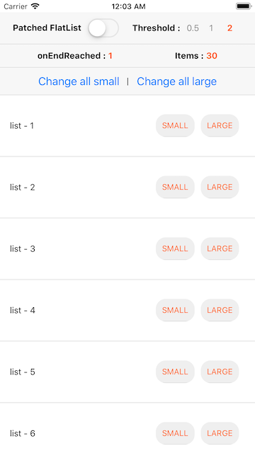
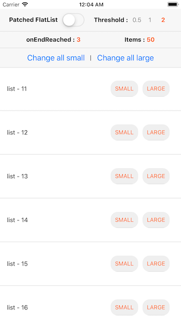

This is for https://github.com/facebook/react-native/pull/26444

-----------

This project is to test the improvement of `onEndReached` feature of FlatList.

1. The list has 10 items at the beginning.
2. When `onEndReached` is called, 10 items are added.

# After the initial rendering
### # Current FlatList

`OnEndReached` is called twice and has 30 items.

### # Patched FlatList

`OnEndReached` is not called and has 10 items.

# After scrolling to the 11th item
### # Current FlatList

`OnEndReached` is called twice, having 50 items.

### # Patched FlatList

`OnEndReached` is called twice, having 30 items.
